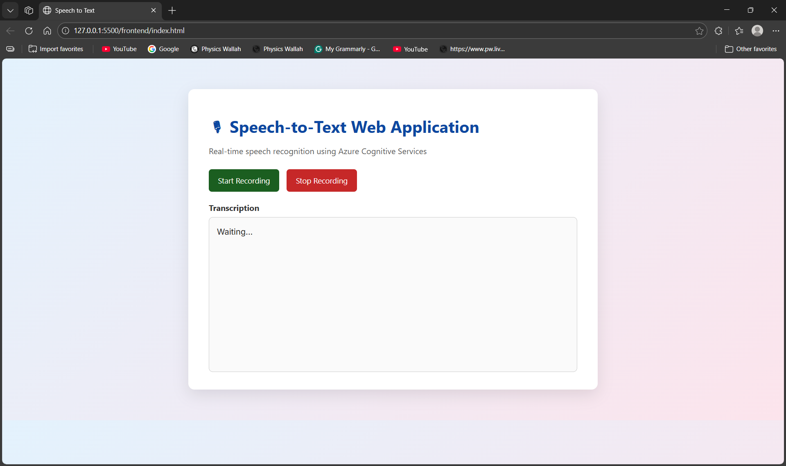
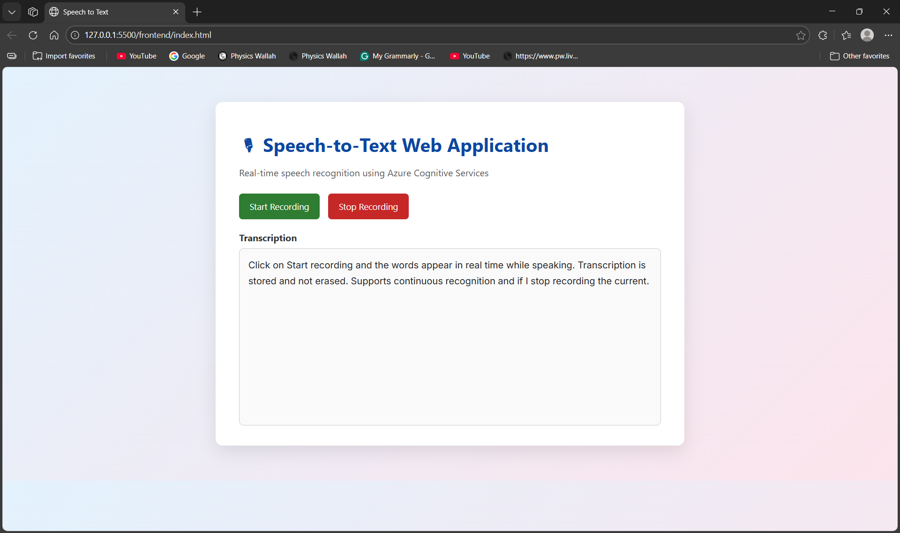

# 🎙 Speech-to-Text Web Application

A simple and clean web application that converts spoken voice into text in real time using Azure Cognitive Services.

This project was built as a technical assignment for Ready.io.

# What This Project Does

🎤 Takes voice input from your microphone
📝 Shows words while you are speaking
💾 Stores all spoken text (nothing gets erased)
⚡ Works in real time with low delay
🎨 Clean and professional user interface

# Technologies Used

🌐 HTML, CSS, JavaScript
☁ Azure Cognitive Services (Speech SDK)
🎧 WebRTC (browser microphone access)
🐍 Python (Flask backend – optional / extensible)

# ⚙ How the Application Works

🎙 The browser captures audio from the microphone
☁ Azure Speech SDK processes the audio
✍ Partial words are shown live while speaking
✅ Final recognized text is saved in the text box

# ▶ How to Run the Project

Open the project folder in VS Code
Go to the frontend folder
Open index.html using Live Server
Allow microphone access in the browser
Click Start Recording and speak
Click Stop Recording when done

# 🎯 Accuracy Improvements Used

📌 Phrase biasing for technical words
⏱ Tuned silence detection for smoother speech
🌍 Language optimized for English (India)

# 📸 Demo Screenshots

## ▶️ Clicking Start Recording

### 🎙 Live Speech Recognition

- Words appear in real time while speaking
- Transcription is stored and not erased
- Supports continuous recognition

### ⏹ Stopping Recording
- Final recognized text remains visible

👤 Author

Mohd Huzaifa
4th Year (CE/minor in AI-ML), NIT Delhi
🔗 GitHub: https://github.com/huzaifa9811

📄 License

This project is created for educational and evaluation purposes only.
